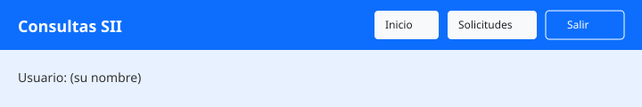
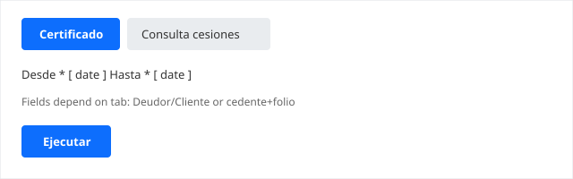
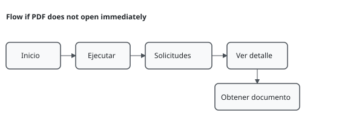
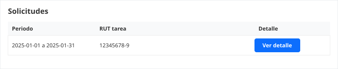
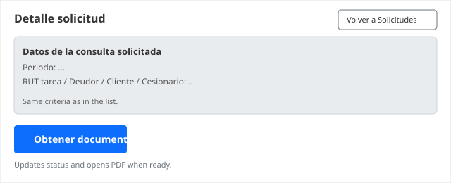

<!--
  Manual de usuario final (perfil demo / Interfactor).
  Version con figuras y mejor maquetacion: abrir manual-usuario-final.html en el navegador
  e Imprimir → PDF. El Markdown sigue siendo la base de texto; las imagenes estan en manual-assets/.
  Generar PDF solo texto: build-manual-pdf.ps1 (ver deploy.md).
-->

# Guía de uso del sistema

Este documento está pensado para **personas que usan la aplicación en el día a día**, sin conocimientos técnicos. Explica **qué botones pulsar y en qué orden** para las tareas habituales.

**Figuras de referencia (esquemas SVG):** carpeta [`manual-assets/`](manual-assets/). Para ver el manual **con imágenes y buen formato**, abra [`manual-usuario-final.html`](manual-usuario-final.html) en el navegador y use **Imprimir → Guardar como PDF**.

Al final hay una **lista de mensajes** que puede ver en pantalla. Los textos entre comillas coinciden con lo que muestra el sistema.

---

## Qué hace esta aplicación

Con esta página web usted puede:

- **Pedir certificados** (periodo Desde/Hasta; RUT de tarea fijado por el sistema; Deudor y Cliente opcionales según su caso).
- **Consultar cesiones** desde **Principal → Consulta cesiones**: folio, RUT cedente y periodo (el cesionario lo aplica el sistema).
- **Hacer consulta masiva de cesiones y pedir certificado masivo** desde **Principal → Certificado masivo**: filtrar, marcar filas y solicitar varios certificados en una sola gestión.
- **Ver solicitudes** en **Solicitudes**, abrir **Ver detalle** y usar **Obtener documento** para el PDF.

Cada usuario **solo ve sus propias solicitudes**. Si necesita otra cuenta o le falta algún acceso, debe pedirlo a quien administra el sistema en su organización.

---

## Antes de empezar

1. Use un **navegador actualizado** (Chrome, Edge o Firefox funcionan bien).
2. Entre a la **dirección web** que le dio su organización (guárdela en favoritos si la usa seguido).
3. Tenga a mano su **usuario y contraseña**. No las comparta.
4. Si al abrir un documento **no aparece una pestaña nueva**, el navegador puede estar bloqueando ventanas emergentes: busque el icono o mensaje en la barra de direcciones y permita ventanas para este sitio.

---

## Cómo está organizada la pantalla

En el menú superior verá **Principal**, **Historial** y **Salir**.

| Sección | Para qué sirve |
|---------|----------------|
| **Principal** | **Consulta cesiones** (inicio) o **Certificado masivo**. |
| **Historial** | **Solicitudes** y, según perfil, historial de cesiones. |

### Opciones de Principal

- **Consulta cesiones** — búsqueda por periodo, cedente y folio (para usuario final).
- **Certificado masivo** — consulta masiva por cedente/deudor/periodo y solicitud de certificado para varias filas.

En **Solicitudes**, el texto aclara que las cesiones se hacen desde **Principal**, no desde esa lista.

---

## Guía paso a paso 1: Entrar y salir

### Entrar

1. Abra la página del sistema.
2. Escriba su **usuario** y su **contraseña**.
3. Confirme o pulse el botón para iniciar sesión.

Si todo va bien, verá un mensaje como: `Sesion iniciada como` seguido de su usuario.

### Si no puede entrar

- Revise que la **clave** esté bien escrita (mayúsculas y minúsculas importan).
- Si dice `Credenciales invalidas`, el usuario o la clave no coinciden: pida ayuda o una clave nueva.
- Si dice `Usuario inactivo`, su cuenta está deshabilitada: debe hablar con el administrador.

### Salir

Use la opción de **cerrar sesión** cuando termine, sobre todo si usa una computadora compartida. Verá: `Sesion cerrada.`

### Si de pronto deja de funcionar mientras trabaja

Si aparece `Token invalido o expirado.`, su sesión caducó: **cierre sesión y vuelva a entrar** con usuario y contraseña.

---

## Guía paso a paso 2: Pedir un certificado (pestaña Certificado)

1. Pulse **Principal** en el menú y entre a **Consulta cesiones**.
2. Asegúrese de estar en la pestaña **Certificado** (no en Consulta cesiones).
3. Elija las fechas **Desde** y **Hasta** del periodo que necesita (son obligatorias). Puede usar el calendario del navegador.
4. Si corresponde a su caso, complete **Deudor (opc.)** y **Cliente (opc.)** con los RUT; puede escribirlos con o sin puntos.
5. No debe cambiar el **RUT tarea (fijado)**; lo pone el sistema según su perfil.
6. Pulse **Ejecutar**. El botón puede mostrar `Ejecutando...` unos segundos.
7. Espere el mensaje en la parte superior de la pantalla:
   - Puede decir `Solicitud registrada. Obteniendo el documento...` y luego intentar abrir el PDF.
   - Si el PDF está listo, puede ver: `Si el navegador lo permite, el PDF se abrira en una nueva pestana.` y se abrirá una pestaña con el documento.
8. **Si no se abre el PDF** o el trámite sigue en proceso, vaya a **Solicitudes** → **Ver detalle** → **Obtener documento** (guía 5).

En la misma pantalla hay un recuadro de **Instrucciones** que resume estos pasos.

---

## Guía paso a paso 3: Consultar un folio en cesiones (pestaña Consulta cesiones)

Use esta guía cuando quiera saber si un **folio** concreto, de un **cedente** concreto, aparece en el periodo elegido, respecto del libro de facturas cedidas al cesionario que usa su empresa (Interfactor). **Usted no ingresa el RUT del cesionario**: el sistema lo aplica solo.

1. Pulse **Principal** y entre a **Consulta cesiones**.
2. Cambie a la pestaña **Consulta cesiones**.
3. Elija **Desde** y **Hasta** (fechas obligatorias).
4. Escriba el **RUT del cedente** (puede usar formato con puntos y guión, por ejemplo como en el ejemplo de la caja).
5. Escriba el **folio del documento** (número del documento que busca).
6. Pulse **Ejecutar**. Mientras trabaja puede ver mensajes de espera en la pantalla, por ejemplo:
   - `Buscando si ya hay resultados guardados...`
   - `No hay resultados previos. Consultando...`
   - `Actualizando la consulta y guardando resultados...`
   - `Cargando resultados actualizados...`
7. **Resultado:**
   - Si hay datos, aparece el bloque **Resultado de la consulta** con las tarjetas de información. Puede ver la etiqueta `Documento Cedido a Interfactor` cuando aplica.
   - Si el proceso terminó pero **no hay coincidencia** para ese folio en ese libro, leerá: `Folio no se encuentra entre las facturas cedidas a interfactor.`
8. En la barra superior puede aparecer un resumen, por ejemplo cuántos registros se encontraron o si hubo que consultar al servicio. Si pide el RUT o el folio y usted los dejó vacíos, complete los campos y vuelva a **Ejecutar**.

Si el sistema le pide esperar o reintentar en una consulta de cesiones, use de nuevo **Principal → Consulta cesiones** con los mismos datos cuando indique el mensaje.

---

## Guía paso a paso 4: Consulta masiva de cesiones y certificado masivo

Use esta guía cuando necesite revisar un conjunto de cesiones y pedir certificados para varias filas en un solo flujo.

1. En el menú superior, pulse **Principal** y luego **Certificado masivo**.
2. Complete los campos obligatorios:
   - **RUT cedente**.
   - **RUT deudor**.
   - **Desde** y **Hasta**.
3. Respete el límite de periodo indicado por el sistema (máximo 30 días). El **RUT cesionario** lo aplica el sistema automáticamente.
4. Pulse **Consultar cesiones**.
5. Revise el **Listado de la consulta**:
   - Puede usar **Acortar el listado** para filtrar por folio, nombre, RUT o monto.
   - Puede usar **Búsqueda avanzada** con **Folio desde / Folio hasta** para acotar solo la tabla en pantalla.
   - Puede ordenar pulsando el título de cada columna y avanzar por páginas.
6. Marque las filas de interés con la casilla:
   - Puede marcar por fila o usar **Marcar todas las de esta página**.
   - Solo se marcan filas con **Nº identif.** disponible.
7. Pulse **Obtener certificado(s)** para enviar la solicitud masiva.
8. Si no se abre documento de inmediato, vaya a **Historial → Solicitudes**, abra **Ver detalle** y use **Obtener documento**.

---

## Guía paso a paso 5: Ver sus solicitudes y buscar una

**Solicitudes** (trámites en general, como certificados):

1. Pulse **Solicitudes** en el menú.
2. Use el cuadro de búsqueda si quiere filtrar por texto.
3. Use los botones de **página** si hay muchas solicitudes.
4. Pulse **Ver detalle**. Se abrirá el detalle con **Datos de la consulta solicitada** (periodo y RUTs como en la tabla). **No hay descarga de PDF desde esta lista.**

---

## Guía paso a paso 6: Abrir el detalle y conseguir el documento (PDF)

1. En **Solicitudes**, pulse **Ver detalle** en la fila correspondiente (o **Volver a Solicitudes** si ya estaba en el detalle y quiere elegir otra).
2. Arriba verá el recuadro **Datos de la consulta solicitada** con el periodo y los RUT que usó al hacer la solicitud.
3. Lea el texto de ayuda **Cómo usar esta pantalla**: suele indicar si debe usar **Obtener documento**.
4. Pulse **Obtener documento**. El sistema consulta el estado, pide el resultado si hace falta e intenta abrir el PDF cuando exista.
5. Si el mensaje dice que el trámite **aún no tiene número de seguimiento**, espere unos segundos y:
   - vuelva a **Solicitudes**, abra de nuevo **Ver detalle** y pulse **Obtener documento**, **o**
   - vuelva a **Principal** y ejecute de nuevo en **Consulta cesiones** con los mismos datos si el mensaje lo indica para esa consulta.
6. Si indica que el documento **aún no está listo**, espere unos minutos y vuelva a intentar **Obtener documento** en el detalle.

**Nota:** El PDF se obtiene desde el **detalle** con **Obtener documento**. Si aparece `Documento de resultado no disponible; obtenga primero el resultado desde la solicitud.`, use primero **Obtener documento** en el detalle.

---

## Si algo sale mal (resumen práctico)

| Situación | Qué hacer |
|-----------|-----------|
| No abre el PDF en pestaña nueva | Permita ventanas emergentes para este sitio; intente de nuevo. |
| “Espere unos segundos” / trámite en proceso | En el **detalle**, pulse **Obtener documento** otra vez; en consultas de cesiones puede reintentar también desde **Principal → Consulta cesiones** con los mismos datos. |
| Le pide corregir fechas o RUT | Revise que las fechas estén completas y el RUT bien escrito (incluido el dígito verificador). |
| `Credenciales invalidas` / sesión caducada | Vuelva a entrar; si falla, pida ayuda al administrador. |
| `Solicitud no encontrada` | Vuelva a la lista y elija otra fila; puede haber tocado un enlace viejo. |
| Mensaje largo o confuso que no entiende | Copie el texto completo (o haga una captura de pantalla) y envíelo a soporte o al administrador con la hora aproximada. |
| Algo que antes funcionaba y ahora no | Compruebe su internet; cierre sesión y entre de nuevo; si sigue igual, informe al administrador. |

---

## Mensajes que puede ver (referencia rápida)

La aplicación muestra en la parte superior **el mismo texto** que envía el sistema cuando hay un error, para que usted sepa qué pasó. Algunos son muy técnicos: no hace falta entenderlos todos; basta con **copiarlos** si pide ayuda.

### Al iniciar sesión

- `Sesion iniciada como ...` — correcto.
- `Sesion cerrada.` — cerró sesión correctamente.
- `Credenciales invalidas` — usuario o clave incorrectos.
- `Usuario inactivo` — cuenta deshabilitada; hable con administración.
- `Token invalido o expirado.` — vuelva a iniciar sesión.

### Al ejecutar en Principal (certificado o cesiones)

- `Ejecutando...` / `Procesando...` — espere.
- `Solicitud registrada. Obteniendo el documento...` — sigue el proceso automático.
- `Operacion registrada. Podras verla en Solicitudes.` — para algunos tipos de trámite debe ir a Solicitudes.
- `Ingresa el RUT del cedente.` / `Ingresa el folio del documento.` — complete esos campos.
- `Ingresa el RUT de la tarea en el primer campo.` — en pantallas donde usted debe poner el RUT principal (no suele pasar en el perfil con RUT fijado en certificado).

### Certificado masivo (consulta y selección de filas)

- `Consultar cesiones` — inicia la búsqueda masiva por cedente, deudor y periodo.
- `Obtener certificado(s)` — solicita certificados para las filas marcadas.
- `El folio desde no puede ser mayor que el folio hasta. Corrige los valores para aplicar el filtro.` — ajuste el rango de folios en búsqueda avanzada.
- `No hay filas que coincidan con lo que escribiste. Prueba con otra palabra o borra el filtro.` — no hay coincidencias con el filtro de tabla.
- `Marcar todas las de esta pagina (con numero de identificacion)` — selecciona solo filas visibles y válidas para certificado.

### Consulta cesiones (estados y resultados)

- `Buscando si ya hay resultados guardados...`
- `No hay resultados previos. Consultando...`
- `Actualizando la consulta y guardando resultados...`
- `Cargando resultados actualizados...`
- `Se encontraron N registro(s) guardados previamente.`
- `Se muestran N fila(s) guardadas tras el servicio.` (puede ir seguido de otro mensaje)
- `Consulta finalizada. Hay N registro(s) para revisar.`
- `Consulta finalizada. No se encontraron registros para mostrar.`
- `No se pudo registrar la solicitud. Intenta de nuevo.`
- `Error en la consulta de cesiones.` — reintente; si persiste, informe a soporte.

**Consulta cesiones, si el trámite aún no tiene seguimiento:**

- `El tramite aun no tiene numero de seguimiento. Espera unos segundos y vuelve a intentar desde Principal (Consulta cesiones) con los mismos datos.`
- Para certificado masivo, si no aparece el documento al instante, revise la solicitud en **Historial → Solicitudes** y use **Obtener documento**.

### Texto fijo en pantalla cuando no hay coincidencia de folio

- `Folio no se encuentra entre las facturas cedidas a interfactor.`

### Pipeline de documento (certificados / detalle)

- `El tramite aun no tiene numero de seguimiento. Espera unos segundos y en Solicitudes abre la solicitud y pulsa Obtener documento, o vuelve a ejecutar desde Principal.`
- Mensajes que mencionan `No se pudo obtener el resultado todavia; el tramite puede seguir en proceso.` — espere y reintente **Obtener documento** en el detalle (o lo que indique el mensaje).
- `Si el navegador lo permite, el PDF se abrira en una nueva pestana.`
- `El documento aun no esta listo; el tramite puede seguir en proceso. Reintenta Obtener documento en el detalle mas tarde.`
- `Ocurrio un error al contactar el servicio.` — compruebe conexión e intente de nuevo.

### PDF y permisos

- `Documento de resultado no disponible; obtenga primero el resultado desde la solicitud.` — primero **Obtener documento** en el detalle.
- `Si el navegador lo permite, el documento se abrira en una nueva pestana.`
- `No autorizado para esta vista.` — su usuario no tiene permiso; consulte al administrador.
- `Solicitud no encontrada.` — vuelva a la lista.

### Validación de datos (fechas y RUT)

Si escribió mal una fecha o un RUT, el sistema puede mostrar textos como: fechas obligatorias, formato de fecha incorrecto, RUT inválido o dígito verificador incorrecto. **Lea el mensaje y corrija** el dato señalado.

---

## Quién administra el sistema

Las personas con perfil de **administración** configuran el enlace con el SII, usuarios y permisos. Eso no forma parte de esta guía de uso diario.

---

## Cómo obtener este manual en PDF (con imágenes)

1. Abra **`manual-usuario-final.html`** en Chrome o Edge (doble clic o arrastrar al navegador).
2. **Ctrl+P** (Imprimir) → destino **Guardar como PDF**.

Para PDF solo desde Markdown (sin garantía de imágenes): en PowerShell, entre a `modern-app\docs` y ejecute `.\build-manual-pdf.ps1`. Desde otra carpeta use `& ".\modern-app\docs\build-manual-pdf.ps1"` (ruta relativa al proyecto). Detalle en `deploy.md`.
